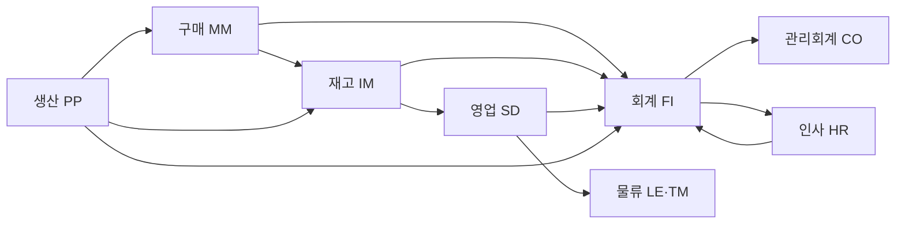

# ERP 핵심 모듈 구조

---

## 1. 모듈 개요

> 기업의 부서/기능을 나눈 시스템 안의 단위 구조.  
> 각 모듈은 하나의 업무 영역을 담당하며, 독립적이지만 하나의 시스템 안에서 유기적으로 연결된다.

### 모듈을 나누는 이유

| 이유 | 설명 |
|------|------|
| **전문화** | 각 업무 영역의 복잡한 로직을 집중해서 처리 |
| **도입 유연성** | 필요한 모듈만 골라서 도입 가능 |
| **유기적 연결** | 모듈 간 데이터 자동 연동, 이중 입력 불필요 |
| **유지보수 용이** | 한 모듈 수정이 다른 모듈에 영향 최소화 |

### 전체 모듈 구성



---

## 2. 구매 모듈 (MM · Material Management)

> 회사가 쓰는 모든 물건, 누가 어떻게 준비할 것인가?  
> 구매 조달 전략을 설계하고, 조달과 창고 흐름을 관리하는 **시스템의 시작점**.

### 주요 프로세스

```
자재 요청 → 발주서 생성 → 공급업체 발송 → 입고 → 검수 → 재고 반영
```

### 다른 모듈과의 연결

| 연결 모듈 | 내용 |
|-----------|------|
| **재고(IM)** | 입고 처리 시 재고 수량 자동 증가 |
| **회계(FI)** | 입고 완료 시 매입 전표 자동 생성 |
| **생산(PP)** | 생산 계획에 따라 자재 소요량 자동 산출 후 발주 |

---

## 3. 재고 모듈 (IM · Inventory Management)

> 창고 안의 물건을 정확하게 파악하고 관리하는 모듈.  
> 입고와 출고가 일어날 때마다 재고를 실시간으로 반영한다.

### 주요 프로세스

```
입고 등록 → 재고 증가 → 출고 요청 → 재고 감소 → 재고 실사(주기적 현물 확인)
```

### 주요 개념

| 개념 | 설명 |
|------|------|
| **입고** | 구매 또는 생산 완료 후 창고에 물건이 들어오는 것 |
| **출고** | 영업 수주 또는 생산 투입을 위해 창고에서 물건이 나가는 것 |
| **재고 실사** | 시스템 수량과 실제 수량이 맞는지 주기적으로 확인하는 작업 |

### 다른 모듈과의 연결

| 연결 모듈 | 내용 |
|-----------|------|
| **구매(MM)** | 입고 발생 시 재고 자동 증가 |
| **영업(SD)** | 출고 처리 시 재고 자동 감소 |
| **생산(PP)** | 생산 투입 시 자재 재고 감소, 완성품 재고 증가 |
| **회계(FI)** | 재고 변동 시 재고 자산 전표 반영 |

---

## 4. 영업 모듈 (SD · Sales and Distribution)

> 고객의 주문이 매출이 되기까지의 모든 과정을 책임지는 모듈.  
> 고객과 직접 만나는 **접점을 관리**한다.

### 주요 프로세스

```
견적 → 수주(고객 주문 확정) → 출고 → 배송 → 송장 발행 → 매출 전표 생성
```

### 다른 모듈과의 연결

| 연결 모듈 | 내용 |
|-----------|------|
| **재고(IM)** | 출고 처리 시 재고 수량 자동 감소 |
| **회계(FI)** | 송장 발행 시 매출 전표 자동 생성 |
| **물류(LE·TM)** | 출고 이후 배송 계획 및 운송 연계 |

---

## 5. 회계 모듈 (FI · Financial Accounting)

> 회사 돈, 어디서 들어오고 어디로 나갔는가?  
> 재무 회계 전반을 담당하며, 모든 모듈의 돈 흐름이 최종적으로 이곳에 집약된다.

### 주요 개념

| 개념 | 설명 |
|------|------|
| **전표** | 돈의 흐름을 기록하는 최소 단위 (매입전표, 매출전표 등) |
| **원장** | 모든 전표를 계정과목별로 모아놓은 장부 |
| **재무제표** | 원장을 기반으로 만드는 결산 보고서 (손익계산서, 재무상태표 등) |

### 주요 프로세스

```
타 모듈에서 거래 발생 → 전표 자동 생성 → 원장 반영 → 월마감 → 재무제표 생성
```

### 다른 모듈과의 연결

| 연결 모듈 | 내용 |
|-----------|------|
| **구매(MM)** | 입고 시 매입 전표 자동 생성 |
| **영업(SD)** | 송장 발행 시 매출 전표 자동 생성 |
| **인사(HR)** | 급여 지급 시 급여 전표 자동 생성 |
| **생산(PP)** | 생산 완료 시 원가 전표 자동 생성 |

---

## 6. 관리회계 모듈 (CO · Controlling)

> 돈을 어디에 썼고, 어디서 벌었는지 파악하는 모듈.  
> FI가 **외부 보고**(세금, 감사)용이라면, CO는 **내부 의사결정**용이다.

### 주요 기능

- 활동별 원가 추적 (부서별, 제품별, 프로젝트별)
- 손익 분석
- 예산 대비 실적 관리

### FI와의 차이

| | FI (재무회계) | CO (관리회계) |
|---|---|---|
| 목적 | 외부 보고 (세무서, 주주) | 내부 의사결정 (경영진) |
| 기준 | 법적 기준 | 경영 기준 |

---

## 7. 생산 모듈 (PP · Production Planning)

> 공장에서 무엇을, 얼마나, 어떻게 만들 것인가?  
> 제조업 중심 기업에 필수적인 모듈.

### 주요 기능

- **BOM (Bill of Materials)**: 제품 한 개를 만들기 위한 자재 목록
- 생산 작업지시 생성
- 자재 소요량(MRP) 계산 → 구매 모듈에 자동 발주 요청

### 주요 프로세스

```
생산 계획 → BOM 기반 자재 소요 계산 → 구매 발주 요청 → 작업지시 → 생산 완료 → 재고 반영
```

---

## 8. 물류 실행 모듈 (LE · Logistics Execution)

> 고객에게 정확하게, 빠르게 보내는 일. 물류와 배송을 책임지는 모듈.

### 주요 기능

- 출고 계획 수립
- 운송 수단 배정
- 배송 실적 처리
- 납기 및 운송비 관리

---

## 9. 운송 관리 모듈 (TM · Transportation Management)

> 운송도 전략이다. 운송 계획과 정산을 최적화하는 모듈.  
> LE보다 훨씬 정교하고, 대규모 복합 운송을 통합 관리한다.

### LE와의 차이

| | LE | TM |
|---|---|---|
| 범위 | 창고 출고 → 배송 | 운송 전략 → 계약 → 정산까지 |
| 수준 | 실행 중심 | 계획·최적화 중심 |

---

## 10. 인사/급여 모듈 (HR · Human Resources)

> 입사부터 퇴사까지, 인사 데이터와 조직 관리를 수행하는 모듈.  
> 사람 중심의 프로세스를 시스템으로 관리한다.

### 주요 프로세스

```
채용 → 입사 등록 → 조직 배치 → 근태 관리 → 급여 계산 → 급여 지급 → 퇴직 처리
```

### 주요 기능

- 조직도 설정 및 인사이동
- 급여 계산 및 지급
- 교육이력 관리

### 다른 모듈과의 연결

| 연결 모듈 | 내용 |
|-----------|------|
| **회계(FI)** | 급여 지급 시 급여 전표 자동 생성 |
| **CO** | 부서별 인건비 원가 반영 |

---

## 11. 모듈 간 연계 흐름 정리

### 구매 → 생산 → 영업 흐름

```
[영업/SD]      수주 접수
   ↓
[생산/PP]      생산 계획 수립 → BOM 기반 자재 소요 계산
   ↓
[구매/MM]      자재 발주 → 입고 → 검수
   ↓
[재고/IM]      재고 증가
   ↓
[생산/PP]      생산 실행 → 완성품 재고 증가
   ↓
[영업/SD]      출고 → 배송 → 송장 발행
   ↓
[물류/LE·TM]  운송 실행
   ↓
[회계/FI]      매입전표 + 매출전표 자동 생성 → 원장 반영
   ↓
[관리회계/CO]  원가 분석 → 손익 보고
```

### 핵심 포인트

> 각 모듈에서 **업무 처리 하나**가 발생하면,  
> 연결된 모듈에 **자동으로 데이터가 반영**된다.  
> 사람이 중간에 따로 입력할 필요가 없다. — 이것이 ERP의 핵심.
